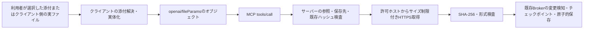

# 添付参照の形式と直接保存の調査（2026-10-06）

## 2026-10-07追記：クライアントによる参照生成を必須とみなせない実測

利用者の依頼で、現在のCodex接続からモデルが作った参照を直接送信できるかを検証した。
設定・製品コードは変更せず、実ファイルの取得URLや他人のファイルは使用していない。
試験先は `https://example.invalid/fileparams-probe.png`、IDは架空の
`probe_file_not_real`、保存先は `00_受け取り/fileparams-negative-probe-20261007.png` とした。

| 入力 | 実接続結果 |
|---|---|
| URL文字列 | クライアントのローカルファイルアップロード処理でWindowsエラー123 |
| URLとIDを含むJSONを文字列化した値 | 同じくクライアントでWindowsエラー123 |
| URLとIDを含むオブジェクトそのもの | サーバーへ到達し、`reference_kind=file_params_object`、`reason=host_not_permitted` で拒否 |

最後の入力は、この接続でモデルが利用できるプログラム経由のツール呼び出しから送った。
モデル向け定義の `file: string` に反してオブジェクトを渡しても、実際の呼び出しでは
クライアントのアップロード処理による再生成を必須にできていなかった。
監査も同じ拒否を記録したため、クライアント側の推測だけではなくサーバー到達を確認できた。

- 操作ID: `fced3343-d799-4e54-becd-3ec92c0a96fc`
- 日時: 2026-10-07 00:58:21 JST
- クライアント表示: `openai-mcp (Codex)`、version `1.0.0`
- 状態: `rejected`。未許可ホスト検査で停止し、ダウンロード・保存には進まない。

判定：モデルが作成したURLと架空IDの組が、この接続からサーバーへ到達可能である。
「クライアントが必ず利用者の選択した添付から参照を生成し、任意URLを排除する」という
前提は、この接続全体の保証には使えない。URL文字列だけの拒否をその保証とみなしてはいけない。
file_idは現在の実装では形式検査のみで、会話所属やURLとの対応を独立に照合していない。

この結果は、外部の攻撃者がツールを呼べること、プロンプト注入の成功、許可ホスト上の
攻撃者ファイルの取得、PCでのコード実行を実証したものではない。それぞれ別の前提が必要。
許可ホスト・HTTPS・DNS/IP検査・保存処理は維持した。ドメイン全体の許可は未実装。
攻撃成立と修正優先度は本試験だけで確定せず、参照の真正性を仮定できないという到達性の証拠とする。

公式仕様は [File APIs](https://developers.openai.com/plugins/reference#file-apis) を再確認。
`selectFiles()` の選択ファイルはプラグインへの許可済みと説明されるが、これは
任意のtools/call引数をすべて同じ選択経路へ強制する保証とは異なる。

記録用コミットメッセージ案: `docs: 添付参照オブジェクトの直接到達とクライアント検証の限界を記録`

## 結論と証拠の範囲

Base64をモデルに扱わせない経路は、既存の `artifact_import_file` で成立する。
サーバーはChatGPT側の添付IDや `/mnt/data` を読むのではなく、クライアントが提供する
fileParamsオブジェクトの一時HTTPS URLからバイト列を取得する。
今回のCodex接続で実在するPNGを指定したところ、1回のツール呼び出しでWindowsの設定済み
workspaceへ保存できた。画像本文のBase64はツール引数にもモデルの出力にも載せていない。

利用者が報告したChatGPTの3失敗については、元リクエストの変換後の参照を取得できていない。
エラーが発生するサーバーの検査条件は特定したが、ChatGPTのどの内部処理がその参照を作ったかは
断定しない。元のJPEGをこのセッションへ再添付した試験でもない。
新しい診断は開発版へ実装した。保護された運用版への配備・再接続は今回行っていない。
実接続の成功は変更前の既存直接取り込み経路の検証であり、新診断の運用版検証ではない。

## 現在のデータフロー



OpenAIの[公式ファイル引数仕様](https://developers.openai.com/plugins/reference#file-apis)を
当日再確認した。サーバー定義は `_meta["openai/fileParams"] = ["file"]`、
`file` のschemaはobjectであり、4プロパティを宣言し、必須は `download_url` と `file_id`。
`mime_type` と `file_name` は任意である。

| 入力 | Windows Local MCPサーバーでの扱い | 解決すべき層 |
|---|---|---|
| 添付IDだけの文字列 | URLを持たず、直接受理しない | ChatGPT／MCPクライアントの添付解決 |
| 元ファイル名だけの文字列 | ファイルの所在や出所を証明しない | 同上 |
| ChatGPT側の `/mnt/data/...` | Windowsから読めるパスではない。直接受理しない | その実行環境にアクセスできるクライアントの実体化 |
| 一時URLだけの文字列 | fileParamsオブジェクトではないので拒否 | クライアントがURLとIDを一緒に渡す |
| URLとIDを含むfileParamsオブジェクト | 形式・許可ホスト等の検査後に取得 | サーバー |
| Codex接続で指定するクライアント端末の絶対パス | Codexが実ファイルをアップロードし、fileParamsに変換してサーバーへ渡す | Codex側の変換 |

Windows Local MCPに `/mnt/data` 読み取りAPIやChatGPT添付ID照会APIはない。
汎用MCPのJSON引数だけで別ホストのローカルファイルが共有されるわけではない。
モデル向け `file: string` とサーバー向けobjectは、クライアント変換がある場合には両立する。

## エラーが発生する条件

発生箇所は `src/windows_local_mcp/attachment_import.py::validate_reference`。
`server.py::artifact_import_file` は、取得や保存へ進む前にこの検査を呼ぶ。
稼働版の同モジュールと作業開始時の開発版は、読み取りによるSHA-256照合で一致した
（`430da440672ebbae39100da792d2f52cc43e8c05bcdf40d23d8cabffaf2a4f43`）。

- `invalid file reference`: `file` がobjectではない、または未知プロパティを含む。
- `missing file reference field`: URLまたはIDが欠けている、空、文字列ではない。
- `invalid file identifier`: object内の `file_id` が、ASCII英数字・`_`・`-`の1〜256文字を満たさない。
- URLにはHTTPS／443、認証情報・fragmentなし、許可ホスト完全一致等の別検査がある。

提示された `file_000...` 形式のIDは、そのままobjectの `file_id` に入れば現在のID検査を通る。
ID文字列を `file` へ直接渡した場合は `invalid file reference` になり、
`invalid file identifier` にはならない。したがって報告の2件のidentifierエラーを、元ID自体の
不正と説明することはできない。照合した稼働版が当時も同じであれば、変換後のobjectに入った
`file_id` の形式が検査条件から外れていたことを意味する。内容・変換主体は未取得である。

今回のCodex接続で報告の3入力を試した結果は、すべてクライアントの
`failed to upload ... for file` だった。ID・ファイル名はWindowsのファイル未検出、
`/mnt/data/...` はパス未検出となり、サーバーの検査へ届いていない。
これを元のChatGPT失敗の再現成功とは扱わない。

## 実装変更

参照を受理する条件、公開引数、保存・upload APIは変更せず、拒否診断だけを追加した。

```text
ATTACHMENT_REFERENCE_REJECTED: invalid file identifier;
layer=server_reference_validation; reference_kind=file_params_object;
reason=identifier_format; field=file_id; file_id_kind=local_path;
expected=fileParams object {download_url, file_id, mime_type?, file_name?}
```

この例のように、誤ってID欄にパスが入った場合も入力の値を開示せず区別できる。
`reference_kind` はobject、添付IDらしい文字列、パス、URL、ファイル名、通常文字列、欠落、
配列、その他の型を固定ラベルで分類する。分類は診断用途であり、許可の判断には使わない。
`reason` はobject必須、未知項目、必須値欠落、ID形式、metadata形式、URL形式・方針、
配信ホスト形式、許可先不一致を区別する。未知キー名・値はエラーにも監査にも転記しない。
ツール説明にも、クライアントでの実体化が必要であることを追加した。

## 最短経路と代替

1. fileParams対応クライアントでは、選択された添付を `artifact_import_file` へ渡す。
   サーバー側保存は1回のMCP呼び出し。クライアント内部のアップロードやURL作成は別の通信である。
2. 実ファイルの絶対パスを受け取るクライアントでは、そのクライアントが実際に読める
   実ファイルを指定する。別セッション・別ホストのパスを指定しない。
3. fileParamsへの実体化が利用できず、プログラムが入力バイト列を持つ場合は、
   既存のupload begin／chunk／commitをプログラム内で順に実行する。
   Base64化とoffset計算はプログラムだけが行い、本文を標準出力やモデルへ返さない。
   今回の測定スクリプトもこの方法で既存uploadを検証している。

fileParamsも入力バイト列にアクセスできるプログラムもないクライアントでは、
サーバー側だけで転送を成立させることはできない。自動フォールバックは追加しない。
将来必要なのは、選択された添付をfileParamsへ変換するクライアント対応、
または添付限定の認証・期限・サイズ・SHA-256を固定できるバイナリ送信APIである。
標準MCP引数へ任意の `/mnt/data` 読み取り能力を追加することは代案にしない。

## セキュリティと互換性

- 任意ローカルファイル読み取り、workspace外保存、未許可ホスト取得を追加していない。
- 公開IP検査・接続先固定・TLS検証・redirect／proxy拒否・サイズ／期限制限を維持する。
- 元ファイル名は保存先に使わず、指定したworkspace内の `path` だけを保存先にする。
- 入力SHA-256を指定した場合の改ざん検知、保存時の再検査、既存CAS／回復を維持する。
- Broker／Sandbox／Approved Hostの権限・境界・設定を変更していない。
- エラーコードと旧文言接頭辞、fileParams schema、begin／chunk／commitを維持する。

既存仕様の制約も維持する。fileParamsの形式やファイルIDは会話への所属を独立証明しない。
「利用者が選択した添付だけ」をクライアント側で保証する必要があり、サーバーでの独立検証を
今回達成したとは主張しない。限定ホストからの取得を認めた既存決定は
`SECURITY_CONTRACT.md` と [添付取り込み仕様](CHATGPT_ATTACHMENT_IMPORT.md) にある。
この制約を解消するには、クライアントから検証可能な添付限定の権限証明が必要である。

## 検証と性能

新規試験・測定の最終結果は `VERIFICATION.md` に記録した。
最終回帰は一括で217成功・2失敗・1スキップ。失敗2件は初期化時のファイル置換で
`WinError 5` となり、テスト本体へ到達していなかった。新しい専用パスで検査を変更せず
再実行し2件とも成功。219件の成功を分割実行で確認した結果である。
日本語と空白を含む元添付名の検査も強化し、そのMCP保存試験を再実行して成功した。
実接続の小さなPNGは161バイト、保存後SHA-256は入力と一致した。
operation_idは `d78adf2b-0375-49c3-82f4-81c0f5b64af4`、呼び出し全体は2,547ms。
これはCodex側の実ファイルアップロード、実HTTPS取得、既存原子的保存を含む値であり、
元ChatGPT添付の検証やBase64経路との性能比較ではない。

追加の実接続では、4,183,461バイトのJPEG（日本語と空白の保存先）と、
4,193,968バイトのPNGを、それぞれ1回の取り込みで保存した。
所要時間は6,293msと7,437ms、operation_idはそれぞれ
`898c385e-4eab-4301-a92d-c11771329fc0`、`e5e7e76e-5a37-465c-bec4-2ed6d685e163`。
入力指定ハッシュ・応答ハッシュに加え、PowerShell `Get-FileHash` による保存先の独立再読取も一致した。
これらはプログラムが生成した非機密画像をCodexが実体化した確認であり、
利用者が元のChatGPTへ添付したJPEGそのものの再試験ではない。
検証ファイルは設定済みworkspace `C:\Users\22905\Personal_knowledge` 内の
`.attachment-probe-20261006.png`、`.attachment-probe-日本語 空白-20261006.jpeg`、
`.attachment-probe-PNG-20261006.png` にある。小さいPNGの削除呼び出しは応答が得られず
待機を終了したため、削除成功を主張せず、その後に存在とハッシュを再確認した。

再現可能な性能比較は `scripts/benchmark_attachment_transfer.py --samples 1`。
MCP SDKクライアントと実Broker保存を使い、DNS・HTTPS接続だけを合成応答へ置き換える。
約256KiB／1MiB／4MiBの実JPEG・PNGそれぞれを、経路ごとに新しいプロセスで1回測った。
以下はJPEGの結果。PNGも同じ呼び出し数の傾向だった。

| 入力バイト数 | 直接取得 ms | 分割upload ms | MCP呼び出し数 直接／upload | 本文Base64文字数 直接／upload |
|---:|---:|---:|---:|---:|
| 265,464 | 508.93 | 639.72 | 1／3 | 0／353,952 |
| 1,049,974 | 519.09 | 786.46 | 1／5 | 0／1,399,968 |
| 4,183,461 | 555.14 | 1,177.36 | 1／10 | 0／5,577,960 |

4MiB程度のJPEGでは、Pythonの追跡対象割り当て最大量は直接取得13.49MiB、
分割upload15.37MiB。区間中のRSS増加の観測値はそれぞれ11.32MiB、16.65MiBだった。
直接取得も全体をメモリに保持して保存するため、一定サイズのメモリだけで済む方式ではない。
モデルが本文を扱う直接取得のテキスト量は0文字。分割uploadの測定もプログラムが本文を保持し、
モデルへ本文を展開しない。表のupload文字数は、手動でモデルに渡す場合の本文量の目安であり、
この測定でその量をモデルへ送ったという意味ではない。

入力ファイル読み取り・プログラムのBase64化・SDK検証・保存処理・計測用JSON生成を含む。
画像生成、サーバー／接続初期化、保存後の検査、実通信、ChatGPT、LLMの処理時間は除く。
tracemallocはPython外の割り当てを含まず、RSSは2msごとの観測で瞬間的な最大量を取り逃し得る。
計測自体の負荷・OSキャッシュも含む単一観測であり、実ChatGPT転送の速度保証ではない。
原データは `.dev-tmp/attachment-reference-20261006/benchmark.json`。
開始・終了時の `src/windows_local_mcp` 内のPythonソースのSHA-256を保存し、
最終比較ではすべて一致した。途中に別作業の並行変更があった測定は比較不成立として除外した。
短い測定用ディレクトリ名を使い、Windowsの長いパス制限による測定用テストの失敗も解消した。
これらは測定スクリプトの修正であり、製品のファイル検査・保存処理を省略するものではない。

コミットメッセージ案: `fix: 添付参照の拒否理由とクライアント変換の診断を追加`
